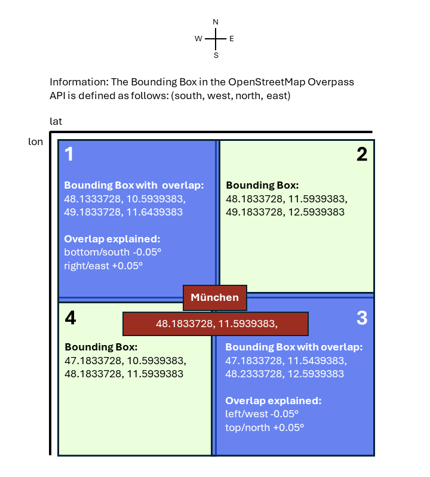

# I found 21 travel destinations after teaching myself 9 tools to complete the analysis

## Context
I started this project without having ever worked with geospatial data before. Neither did I know *any* of the 9 tools that I used, such as QGIS (see section [Applied tools](https://github.com/annika-essmann/day-trip-munich/blob/main/ReadMe.md#applied-tools) for the full list). 

**Thus, I'm a strong autodidact who learned the tools *and* completed this project in roughly 60 hours.**

## Research question
I love to travel and I often use the website https://www.chronotrains.com. It allows to search for all possible destinations that can be reached within a desired travel time from a chosen origin.

But unfortunately, this website mostly features bigger cities, for example it only suggests Augsburg as a potential destination when starting in Munich and travelling for one hour. Though, there are other very interesting villages.

**So, I asked myself: If I wanted to go on a day or weekend trip: Which destinations can I reach from Munich within one hour?**

## Methods
First, I pulled data from the OpenStreetMap Overpass API. Specifically, I requested information on the rail network, train stations and hotels around Munich. 

Then, I analysed the data in the geographic information system software QGIS by employing 8 algorithms to narrow down the rail network, train stations and hotels. I also used SQL WHERE statements to filter the data.

See details in the file [methods.md](methods.md).

## Challenges
Though, this is only a very condensed version of my methods. Along the way, there were a lot of challenges that I had to solve, such as this one:

**Problem**: The data that I wanted to pull from the API is quite large: 20MB.

**Solution**: I divided the map in four segments and I added an overlap of +/- 0.05° for tiles 1 and 3, so that there is a small amount of redundant data. This makes the merge of the files easier later on. 

<picture>

</picture>

## Results
Now, having completed my data exploration I know 21 travel destinations around Munich, for example Landshut (Bay). So, I will roughly need half a year to make every trip…I better reserve my trains now.

**One last word on deployment:** Since my project focused on data exploration, I didn't deploy my results because information like this is used as an input for a deeper analysis that then merits a full deployment. 

**Map data**: [OpenStreetMap](https://www.openstreetmap.org/copyright)  
**Raster**: © GeoBasis-DE / [BKG](https://www.bkg.bund.de/) (2026) [dl-de/by-2-0](https://www.govdata.de/dl-de/by-2-0) (Daten verändert)  
**Details**: [credits.md](credits.md)

## Applied tools
I used the following API, languages and software to complete this project: 
- **OpenStreetMap Overpass API**: to access the geo-spatial data needed
- **Overpass Query Language (OQL)**: to write the query that pulls the data from the API
- **osmconvert, a programme to edit OpenStreetMap data**: to merge the pulled data into one file
- **Windows PowerShell**: to handle osmconvert because it doesn't have a graphical interface
- **QGIS, a geographic information system software**: to analyse and visualise the data
- **Structured Query Language (SQL)**: to filter the data in QGIS
- **git**: to track changes and upload the project to GitHub
- **mark down**: to write a well-layouted ReadMe file
- **Visual Studio Code**: to handle git and edit mark down files

## GenAI usage
ChatGPT and GreenPT were my project tutors that helped me to understand: 
- the syntax of the Overpass Query Language,
- new concepts like EPSG codes, 
- the software osmconvert and QGIS.

See details in the file [genai_usage.md](genai_usage.md)

## Limitations
To simplify my analysis, I only included hotels and disregarded other accommodation types like camping grounds, guest houses or hostels. Adding these could enlarge the number of possible destinations.

Also, I could divide the analysis into destinations for a day trip and a weekend trip. For the former, I don't need a hotel, but potential tourist attractions such as museums or hiking trails. This would certainly result in different destinations.

## Credits 
**Map data**  
[OpenStreetMap](https://www.openstreetmap.org/copyright)

**Raster** 
© GeoBasis-DE / [BKG](https://www.bkg.bund.de/) (2026) [dl-de/by-2-0](https://www.govdata.de/dl-de/by-2-0) (Daten verändert)

See details in [credits.md](credits.md)

## Sources
[1] https://en.wikipedia.org/wiki/Regional-Express